<h1 align="center">
Maya Vieport Capture Tool  【Maya视窗截取工具】
</h1>

---

## 安装说明

> 将 install.mel 拖拽到 maya 视窗当中，当前的工具架会多出一个 摄像机 图标按钮
> 点击 图标按钮 即可打开 窗口

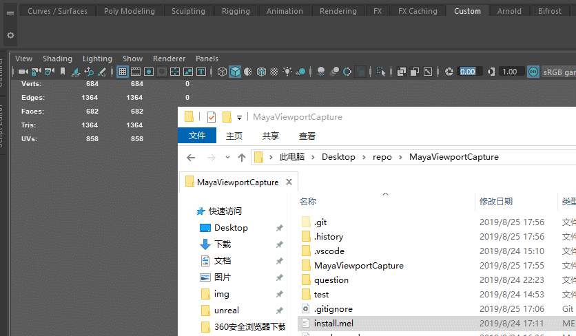

## 使用说明

### 主界面

> 选择需要渲染的物体点击按钮输出合成的图片

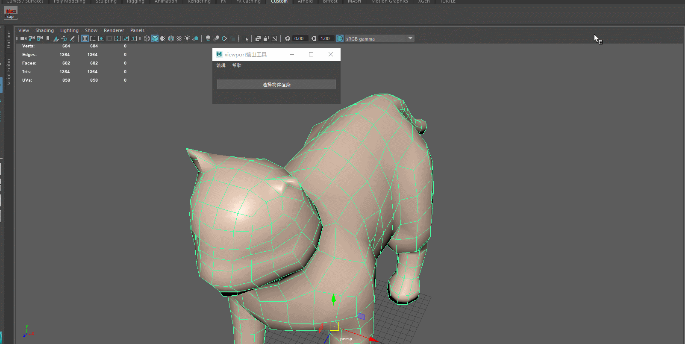

> 输出效果如下图

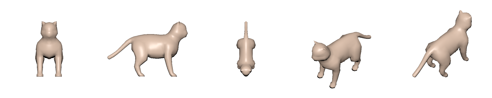

---

> `帮助` 下拉菜单有 `使用帮助` 可以打开帮助网页

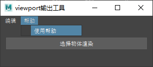
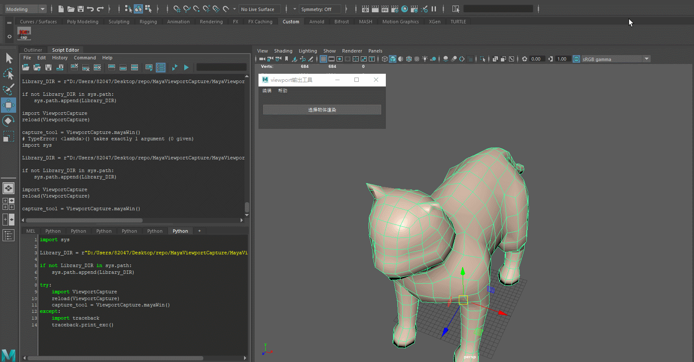

---

> `编辑` 下拉菜单有 `摄像机设置` `插件设置`
> 可以打开插件的设置面板

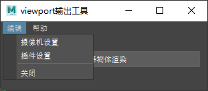
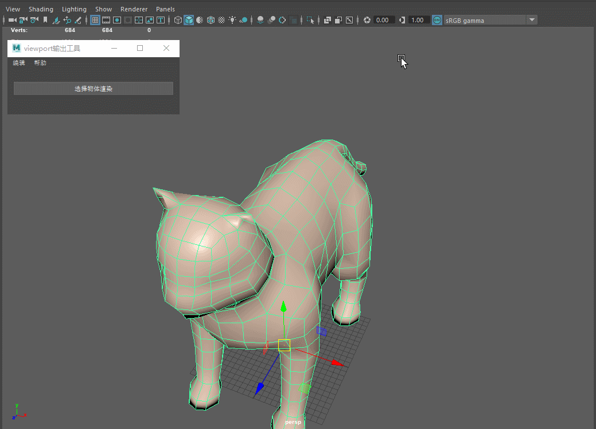

## 摄像机设置

> 默认提供了5个角度
> 可以根据自己的需要对摄像机进行调整

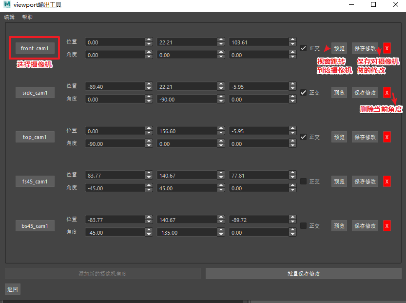
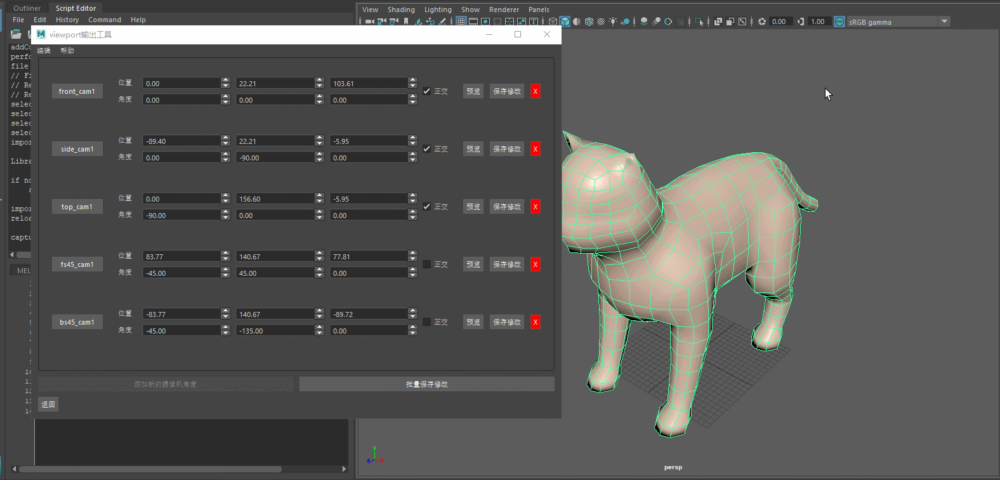

> 最后输出的图片如下

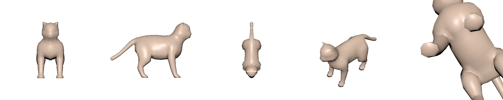

> 下拉菜单可以将当前设置导出导入以及重置

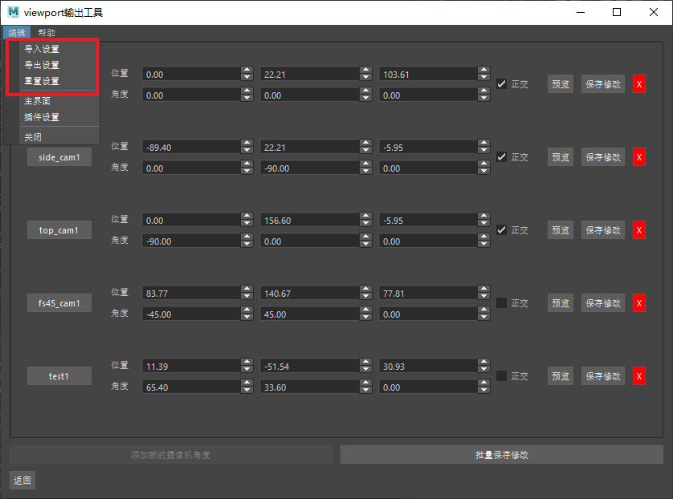

## 插件设置

> 可以通过插件设置调节输出的方式
> 聚焦程度是插件默认自动生成的5个角度的聚焦程度
> 可以再摄像机设置里面重置设置来重新自动生成新的5个角度

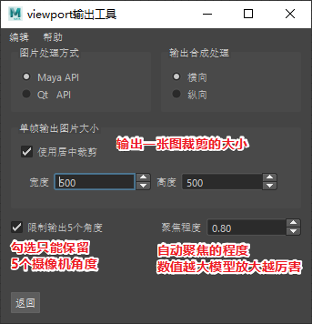

> 这里的设置也可以导入导出和重置
> 默认会存储和读取到 脚本目录 json 文件夹下的 setting.json 文件

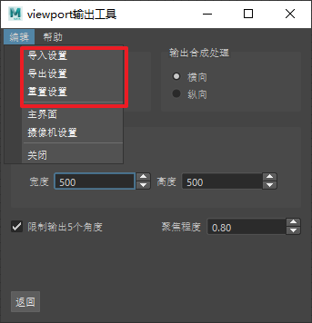

## 开发总结

> &emsp;&emsp;这个插件是为了完成一项测试题开发的。
> &emsp;&emsp;测试题详情可以参照 question 目录下 [readme.md](question/readme.md) 文件

> &emsp;&emsp;其实之前在我也曾经开发过类似的工具
> &emsp;&emsp;当时也需要实现对物体不同角度输出viewport 图片以及 Arnold 渲染的图片
> &emsp;&emsp;不过当时没有使用 API 进行图片拼接，而是使用 ffmpeg 将多张图片合成视频
> &emsp;&emsp;后续的流程是通过RV播放器单帧浏览视频的流程来使用的。
> &emsp;&emsp;因此当时输出图片也没有用到 API 而是使用 cmds.playblast 工具

> &emsp;&emsp;使用 API 来处理图片是我完全没想到的方案。
> &emsp;&emsp;因为之前公司处理图片都是基于 Python PIL 库来实现
> &emsp;&emsp;但是这个库有很多 C 语言编译的 Pyd 文件，官方编译的 pyd 和 Maya 编译VS的版本不兼容
> &emsp;&emsp;运行起来会导致 Maya 报错。

> &emsp;&emsp;当时我们的解决方案是通过 subprocess 开一个外部 Python 进程对图片进行处理。
> &emsp;&emsp;不过开进程的开销还是挺大的，好在我们那个时候的需求也不需要等待处理的结果。
> &emsp;&emsp;否则Maya要未响应10多秒才能动。

> &emsp;&emsp;后来经过我多方的查询，在网上找到了别人编译好的 PIL 库，完美兼容 Maya 
> &emsp;&emsp;虽然这个 PIL 库版本有点老，但是图片的基础编辑还是没有问题的
> &emsp;&emsp;最重要的是不用开进程，效率高。

> &emsp;&emsp;在收到测试题前不久，我查询文档的时候也偶然发现了 C++ 的 MImage 类
> &emsp;&emsp;那个时候我就意识到或许 Maya 自身就能完成一些基础的图片编辑工作。
> &emsp;&emsp;不过那个时候因为工作原因没有去深究 MImage 的使用。

---

### MImage 图像处理
> &emsp;&emsp;直到开发这个插件才开始在网上搜索 MImage 的使用方法。
> &emsp;&emsp;这里面的坑还是有不少的。

> &emsp;&emsp;MImage 的 API 还比较简单，很多功能都需要手动实现。
> &emsp;&emsp;其中最为让我困惑的就是 pixels 转颜色的输出
> &emsp;&emsp;需要将长整形的数据调用 ctypes 获取指针数据然后转换为 字符串
> &emsp;&emsp;转换的字符串就是 ASCII 码 0 - 255 的范围上了，最后需要用 ord() 函数将数据转换为数值
> &emsp;&emsp;当然也可以在一步将数据转为 QImage 再作处理， Qt 的图片处理能力比 Maya API 强

> &emsp;&emsp;获取到像素颜色数据之后，后续的操作都好说。
> &emsp;&emsp;只是因为数据是 1 维数组，获取像素位置需要做转换，比较麻烦而已。

### QImage 图像处理

> &emsp;&emsp;借助 QPainter 来绘制图像叠加到原图上 ，并且 MImage 的处理要简单很多。
> &emsp;&emsp;因为不需要单独对每一个像素进行处理了， QPainter 的 drawImage 封装处理了。
> 
> &emsp;&emsp;不过 QImage 还是有些问题，没有 MImage 来得完美 _(:з」∠)_
> 1. drawImage 覆盖图片 alpha 值为零的部分不会覆盖到背景图上，这导致输出 jpg 的时候图片颜色不对
> 2. Qt 处理 RGBA 图片的时候会有图片数据的丢失的情况
> 
> &emsp;&emsp;最后临门一脚的时候，发现 Qt 截取 Maya Viewport 无法批量截取多张图，
> &emsp;&emsp;导致合成的时候全都是最后一张图，这个问题还有待解决。

### PIL 库 

> &emsp;&emsp;原本这个库是在网上找到的，兼容 Maya 编译的 PIL 库。
> &emsp;&emsp;然而目前无法在 Maya2019 上使用了，估计是 Maya 版本太新了，使用了不同 VS 版本的编译工具了

### UI开发

> &emsp;&emsp;其实类似地开发UI对接json数据我很早之前就弄过了，算是驾轻就熟了。
> &emsp;&emsp;遗憾的是，之前一直没能够将 python Qt 库做好封装，
> &emsp;&emsp;很多东西都需要从头开始写，代码量也比较大，复用率很低。
> &emsp;&emsp;所以这次开发对接数据也花了一天多的时间才完成_(:з」∠)_

